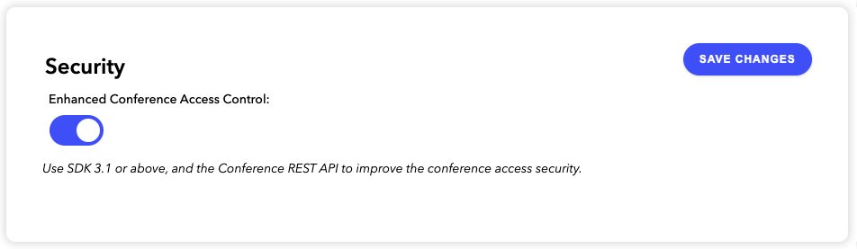

[](LICENSE)

# Sample Application for Conference Access Control

Sample application that uses the Web SDK with Enhanced Conference Access Control. This project is based on the [comms-sdk-web-getting-started](https://github.com/dolbyio-samples/comms-sdk-web-getting-started) repo.

## Setup

Clone this repo:

```bash
git clone https://github.com/dolbyio-samples/dolbyio-web-conference-access-control
```

In the folder you've created, run the following command to install all the package dependencies:

```bash
npm install
```

Create a new application in your dashboard on dolby.io, then go to the settings, check **Enhanced Conference Access Control** in the Security and click SAVE CHANGES.



If you haven't done so already, create an account on [dolby.io](https://dolby.io/signup), it is free so do it today! Go to your dashboard and for the first application, get your `App Key` and `App Secret`.

Create a `.env` file at the root of this folder and insert your consumer key and secret like that:

```
APP_KEY=<Your app key>
APP_SECRET=<Your app secret>
```

Now, start the project with the npm command:

```bash
npm start
```

Or directly with the node command:

```bash
node server.js --port 8081
```

Then you can access the web page at `http://localhost:8081`. You can change the port number with the flag `--port` in the node command.

## Use this project

Open a first web browser at `http://localhost:8081`, provide a conference name and click Create. The conference ID will be provided to you in the second textbox. Copy that ID.

Open a second web browser, paste the conference ID that was just created and click Join. The client will request the backend to be invited with a limited set of permissions.
